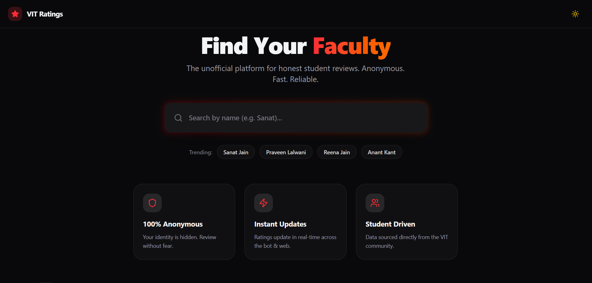

# ⚡ VIT Nexus


**VIT Nexus** is the ultimate student companion platform for VIT Bhopal. It bridges the gap between students, faculty, and campus services through a modern web interface and an intelligent WhatsApp Bot.



> 🔗 **Live Website:** [https://vitnexus.vercel.app](https://vitnexus.vercel.app)

---

## 🚀 Features

### 🌐 Web Platform (VIT Ratings)
- **🕵️‍♂️ Anonymous Faculty Search:** Find faculty details without revealing your identity.
- **⭐ Real-time Ratings:** Rate faculty on Teaching, Grading, and Behavior (1-5 scale).
- **🌗 Dynamic Themes:** Beautiful Dark & Light modes with glassmorphism UI.
- **⚡ Instant Feedback:** Ratings update immediately across the ecosystem using Supabase Realtime.

### 🤖 WhatsApp Bot (VIT Buddy)
- **🔍 Quick Contact:** Get faculty cabin numbers and phone details via WhatsApp.
- **🍔 Mess Menu:** Check daily menus for all hostels (Rassense, Mayuri, Safal, Dakshin).
- **📅 Weekly Schedules:** Plan your meals ahead with weekly menu commands.

---

## 🛠️ Tech Stack

| Component | Technology |
|-----------|------------|
| **Frontend** | React.js, Vite |
| **Styling** | Tailwind CSS (v4), Lucide Icons |
| **Backend & DB** | Supabase (PostgreSQL, Realtime Triggers) |
| **Bot Logic** | Node.js, Baileys Library |
| **Deployment** | Vercel (Web), Render (Bot) |

---

## 💻 Running Locally

Want to contribute or test it on your machine? Follow these steps:

### 1. Clone the Repository
```bash
git clone [https://github.com/Rahul-kr1623/vit-ratings.git](https://github.com/Rahul-kr1623/vit-ratings.git)
cd vit-ratings
```
### 2. Install Dependencies
```bash

npm install
```
### 3. Setup Environment Variables
Create a .env file in the root directory and add your Supabase keys:

```Code snippet

VITE_SUPABASE_URL=your_supabase_url_here
VITE_SUPABASE_KEY=your_supabase_anon_key_here
```
### 4. Start Development Server
```bash

npm run dev
```
Open http://localhost:5173 to see the magic! ✨

## 🤝 Contributing

We welcome contributions from the VIT community!

1. **Fork** the repo.
2. Create a new branch (`git checkout -b feature/AmazingFeature`).
3. **Commit** your changes (`git commit -m 'Add AmazingFeature'`).
4. **Push** to the branch (`git push origin feature/AmazingFeature`).
5. Open a **Pull Request**.

---

## 👤 Author

**Rahul**
- GitHub: [@Rahul-kr1623](https://github.com/Rahul-kr1623)

---
*Built with ❤️ for VITians.*
